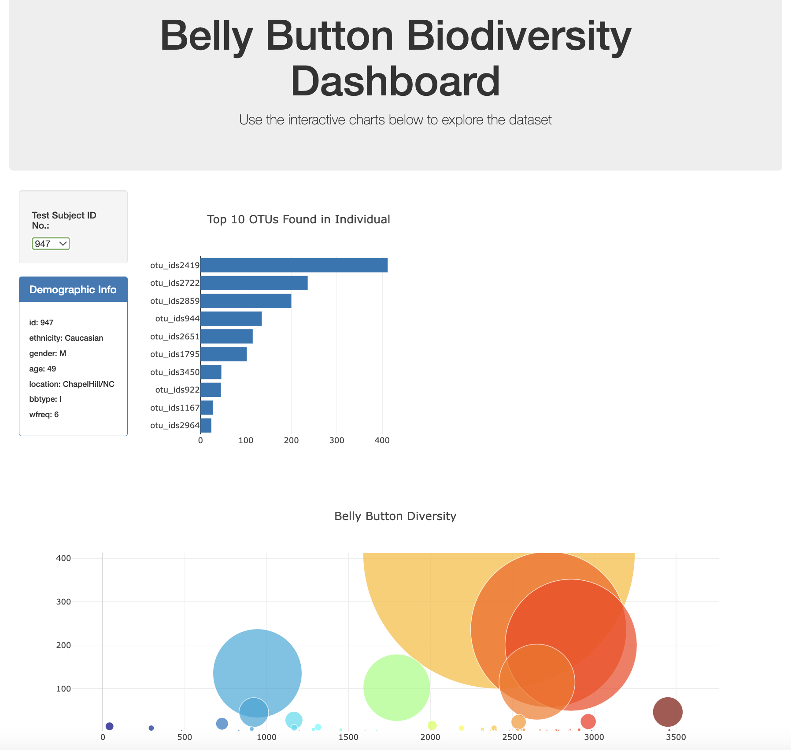

# Belly Button Challenge

## Background
You will build an interactive dashboard to explore the Belly Button Biodiversity dataset, which catalogs the microbes that colonize human navels. 

The dataset reveals that a small handful of microbial species (also called operational taxonomic units, or OTUs, in the study) were present in more than 70% of people, while the rest were relatively rare.

## Process
1. You will use the D# library to read in the samples.json from the URL: https://2u-data-curriculum-team.s3.amazonaws.com/dataviz-classroom/v1.1/14-Interactive-Web-Visualizations/02-Homework/samples.json

2. You will then create a horizontal bar chart with a dropdown menu to display the top 10 OTUs found in the individual you request. 
    - Use sample_values as the values
    - Use otu_ids as the labels
    - use otu_labels as the hovertext
    
    Your bar chart should look like:
    
    
    
3. Create a bubble chart that displays all of the bacteria found in each sample.
    - Use otu_ids for the x values
    - Use sample_values for the y values
    - Use sample_values for the marker size
    - Use otu_ids for the marker colors
    - Use otu_labels for the text values
    
    Your bubble chart should look like:
    
    
    
4. You will need to display the metadata for each individual:

5. All of the plots will need to update when a new sample is selected.
    - Create a function that will display both the bubble chart and bar chart when sample is changed. 
    - Create an init() function to initialize the dropdown menu and set it to the first sample.

    

### Sources
http://robdunnlab.com/projects/belly-button-biodiversity/
